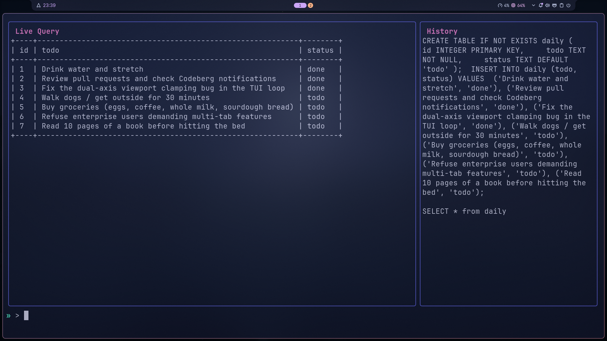

# gopherQl

A gopher sized SQLite IDE for your small databases and learning. Single binary, no SQLite install needed — `modernc.org/sqlite` ships it pure Go.

## Preview



## Stack

- **Go** — language
- **BubbleTea** — TUI framework
- **Lipgloss** — styling
- **modernc.org/sqlite** — pure-Go SQLite driver, no CGO

## Usage

### Release Build 

Just get the executables from [Github Release](https://github.com/initsyscall/gopherql/releases/tag/v1.0.0). And make it executable with `chmod +x ./gopherql*` if youre on unix-like system. Windows exe works fine.

### By Installation

```bash
go install codeberg.org/initsyscall/gopherql@v1.1.0
```


### Run

```bash
go build -o gopherql .
./gopherql database_name.db
```

If the database doesn't exist it's created after a `y/N` confirmation. Command history is stored next to the `.db` file as `database_name_history.json`.

## Layout

- Left (70%) — query results
- Right (30%) — command history
- Bottom — prompt line

## Commands

Type `/` to preview commands, then pick as you type.

| Command | Action |
|---|---|
| `/quit` | exit |
| `/clear` | clear query pane |
| `/burn history` | wipe command history (double confirm) |
| `/burn db` | drop all tables (double confirm) |

## Keys

> [!NOTE]
> This keymap reflects the latest build. For stable release check the stable release note.


| Key | Action |
|---|---|
| `Enter` | run query / command |
| `↑` / `↓` | cycle command history |
| `Ctrl+←` / `Ctrl+→` | jump word backward / forward in prompt |
| `Ctrl+w` / `Alt+Backspace` | delete word backward; `Alt+d` / `Ctrl+Delete` delete word forward |
| `Shift+↑` / `Shift+↓` / `Shift+J` / `Shift+K` | scroll history pane |
| `Ctrl+Shift+↑` / `Ctrl+Shift+↓` / `Ctrl+Shift+J` / `Ctrl+Shift+K` | scroll query pane vertically |
| `Ctrl+Shift+→` / `Ctrl+Shift+←` / `Shift+L` / `Shift+H` | scroll query pane horizontally |
| `Ctrl+c` | quit |

## Manifesto

- **KISS** — only what's needed to work. If it doesn't relate to the program, it's a user problem.
- **Pragmatism** — complexity must justify itself by removing more future maintenance than it adds.
- **Readability** — control flow should be simple and modular; anyone should pick it up without struggling.
- **Modularity** — each file does one thing and does it well. No 'I can do everything' files.
